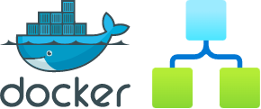
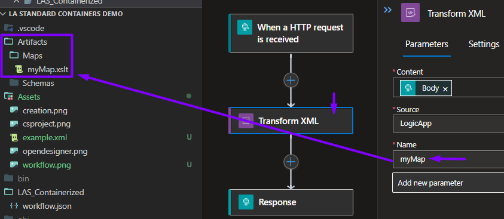
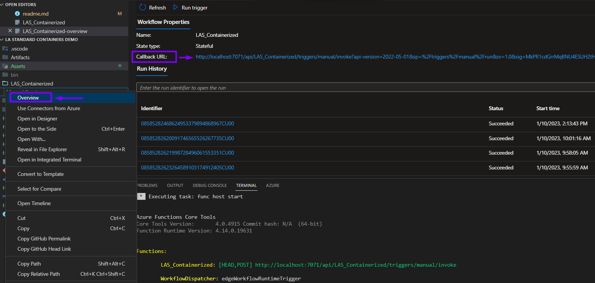
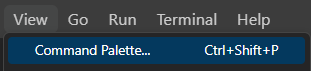
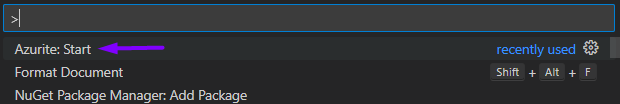
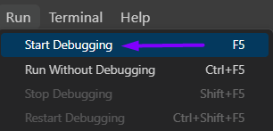
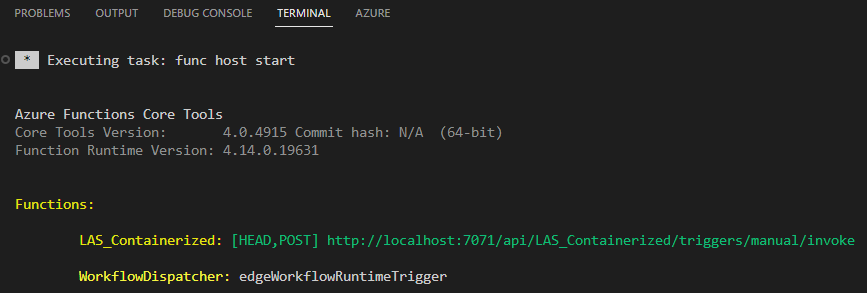

# Containerized Logic Apps (Standard) with XSLT mappings directly in source control



This readme explains how to setup an Azure Logic App (Standard) running in a Docker container. The workflow will contain an XML operation.

The referenced XSLT map wil be defined directly in the source code of the Logic App project. There's no longer a dependency on Azure Integration Accounts.

The information on this page mainly comes from two official Microsoft blogs: 
1. [Running logic apps in a docker container](https://techcommunity.microsoft.com/t5/azure-developer-community-blog/azure-tips-and-tricks-how-to-run-logic-apps-in-a-docker/ba-p/3545220).
2. [XSLT transformation support](https://techcommunity.microsoft.com/t5/integrations-on-azure-blog/net-framework-assembly-support-added-to-azure-logic-apps/ba-p/3669120).

Another advantage is that you can define and run multiple workflows in one and the same Logic App (just like Azure Functions!). Artifacts (like an XSLT mapping) can also be defined once and accessed by all the workflows in the Logic App project 💪.

## Creating the Logic App Project
First of all, currently, you can only create **Standard** Logic Apps through the Azure Portal or VSCode. You need Visual Studio Code for this advanced use-case.

You need the following VSCode Extensions to be installed:

1. [Azure Functions](https://marketplace.visualstudio.com/items?itemName=ms-azuretools.vscode-azurefunctions)
2. [Azure Logic Apps (Standard)](https://marketplace.visualstudio.com/items?itemName=ms-azuretools.vscode-azurelogicapps)
3. [Azure Core Tools](https://marketplace.visualstudio.com/items?itemName=ms-vscode.vscode-node-azure-pack)
4. [Azurite](https://marketplace.visualstudio.com/items?itemName=Azurite.azurite)

You also need Docker Desktop (or Rancher Desktop) for building and running your container and Postman for sending requests.

### Creation

Create a new Logic App (Standard) project:


You can choose between a stateful or stateless workflow, it doesn't really matter for this POC.

Continue by manually creating a ```.csproj``` file.
This is necessary for a NuGet-based approach. This part is necessary to run it in a docker container in one of the later steps...


Make sure to target .NET 6 and Azure Functions v4.
You can use [this code](../LA%20Standard%20Containers%20Demo/LASDemo.csproj) as a boilerplate. Don't forget to align the Workflow name with yours!

### Adding an XML Operation
If you have the extension installed, you can edit your workflow inside VSCode by right-clicking the ```workflow.json``` file and choosing ```Open in Designer```:


Create a simple workflow. For e.g. an HTTP POST request where you post an XML in the body ([example input](./Assets//example.xml)) and convert it to HTML using an XSLT map ([myMap.xslt](./Artifacts/Maps/myMap.xslt)):



As you can see in the screenshot above, you place the mapping in the ```Maps``` folder. You can then point to this specific mapping through Name parameter of the XML operation.

### Overview

When you right-click the workflow.json file, you also have an ```Overview``` option.

Here you can find the Run History and Callback URL.

Be aware that this screen will only be able to fetch the right information when the project is **actually running locally**:



### Running the project
First, you need to add your Azure Storage connection string in the ```local.settings.json``` file:

```
{
  "IsEncrypted": false,
  "Values": {
    "AzureWebJobsStorage": ".....connection string here.....",
    .
    .
    .
  }
}
```

After that need to start Azurite for emulating the Azure Storage:





Now you have everything to run the project locally:



