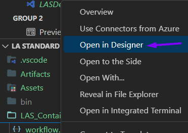

# 🧙‍♂️ Containerized Logic Apps (Standard) with XSLT mappings directly in source control

This repository explains how to setup an Azure Logic App (Standard) with an XML transformation action.

The XSLT map wil be defined directly in the source code of the Logic App project, meaning,there's no need of an Integration Account in Azure!

After that we will run the Logic App (Standard) inside a docker container locally and expose a port (80).

I based myself on two official Microsoft blogs: 
1. [Running logic apps in a docker container](https://techcommunity.microsoft.com/t5/azure-developer-community-blog/azure-tips-and-tricks-how-to-run-logic-apps-in-a-docker/ba-p/3545220).
2. [XSLT transformation support](https://techcommunity.microsoft.com/t5/integrations-on-azure-blog/net-framework-assembly-support-added-to-azure-logic-apps/ba-p/3669120).

> Previously, customers were able to upload XSLT maps to an Integration Account where a consumption-based logic app could execute that map via an out of box action. Microsoft is now bringing similar capabilities to Azure Logic Apps (Standard), but without a dependency on the Integration Account.

Another advantage is that you can define and run multiple workflows in one Logic App. The same for artifacts (like an XSLT map), these can be defined once and used by all the workflows in your Logic App project.

## Creating the Logic App Project
First of all, currently you can only create **Standard** Logic Apps through the Azure Portal or VS**Code**.

In order to create a logic app you will have to download the following extensions:

1. [Azure Functions](https://marketplace.visualstudio.com/items?itemName=ms-azuretools.vscode-azurefunctions)
2. [Azure Logic Apps (Standard)](https://marketplace.visualstudio.com/items?itemName=ms-azuretools.vscode-azurelogicapps)
3. [Azure Core Tools](https://marketplace.visualstudio.com/items?itemName=ms-vscode.vscode-node-azure-pack)
4. [Azurite](https://marketplace.visualstudio.com/items?itemName=Azurite.azurite)

You also need Docker Desktop (or Rancher Desktop) for building and running your container and Postman for sending requests.

### Creation


Using the extensions, create a new Logic App (Standard) project:


You can choose between a stateful or stateless workflow, it doesn't really matter for this POC.

Continue by manually creating a ```.csproj``` file.
This is necessary for a NuGet-based approach. This part is necessary to run it in a docker container in one of the later steps...


Make sure to target .NET 6 and Azure Functions v4.
You can use [this code](../LA%20Standard%20Containers%20Demo/LASDemo.csproj) as a boilerplate. Don't forget to align the Workflow name with yours!

### Adding an XML Operation
If you have the extension installed, you can edit your workflow inside VSCode by right-clicking the ```workflow.json``` file and choosing ```Open in Designer```:



